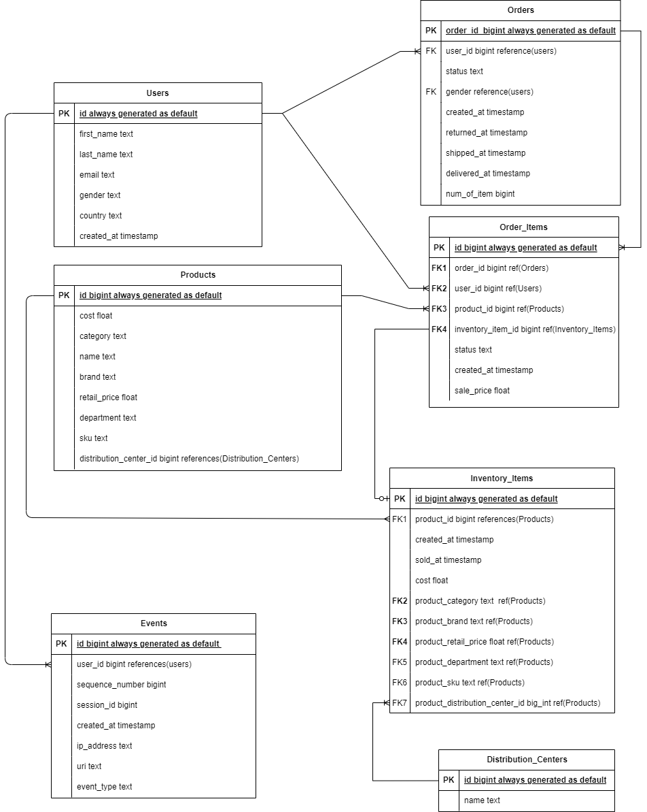

# **E-Commerce Data Model Research**

## Overview 
E-commerce databases typically include entities representing mcustomers, products, orders, inventory, shipping, payments,,
and user interactions. The goal is to track transactions, inventory management, customer behaviour, and website events.

## Examples of Models Reviewed
### 1. Northwind Traders Database: [Northwind](https://docs.yugabyte.com/preview/sample-data/northwind/)
- **Key tables:** Customers, Orders, Order Details, Products, Categories, Suppliers  
- **Relationships:** Customers place Orders; Orders consist of multiple Order Details linked to Products. 
- **Notable features:** Classical example widely used for teaching; focuses on basic sales and inventory.

### 2. **The Look E-Commerce Public Dataset:** [ TheLook E-Commerce](https://console.cloud.google.com/marketplace/product/bigquery-public-data/thelook-ecommerce?pli=1)
- **Key tables:** customers, products, orders, logistics, web events and digital marketing campaigns. 
- **Relationships:** Users place Orders; Orders have many Order Items linked to Products and Inventory; Products stocked in Distribution Centers. 
- **Notable features:** Realistic, modern schema capturing inventory and web interaction data.

### Common Entities and Relationships

| Entity               | Description                             | Typical Relationships                              |
|----------------------|-----------------------------------------|----------------------------------------------------|
| Users/Customers      | Registered users of the e-commerce site | One-to-many with Orders and Events                 |
| Products             | Items sold on the platform              | One-to-many with Order_Items, Inventory            |
| Orders               | Transactions made by users              | One-to-many with Order_Items                       |
| Order_Items          | Details for each product in an order    | Many-to-one with Orders and Products               |
| Inventory_Items      | Records representing stock units        | Many-to-one with Products and Distribution Centers |
| Events               | Web tracking data for user interactions | Many-to-one with Users                             |
| Distribution_Centers | Warehouses or stores stocking products  | One-to-many with Inventory_Items                   |

